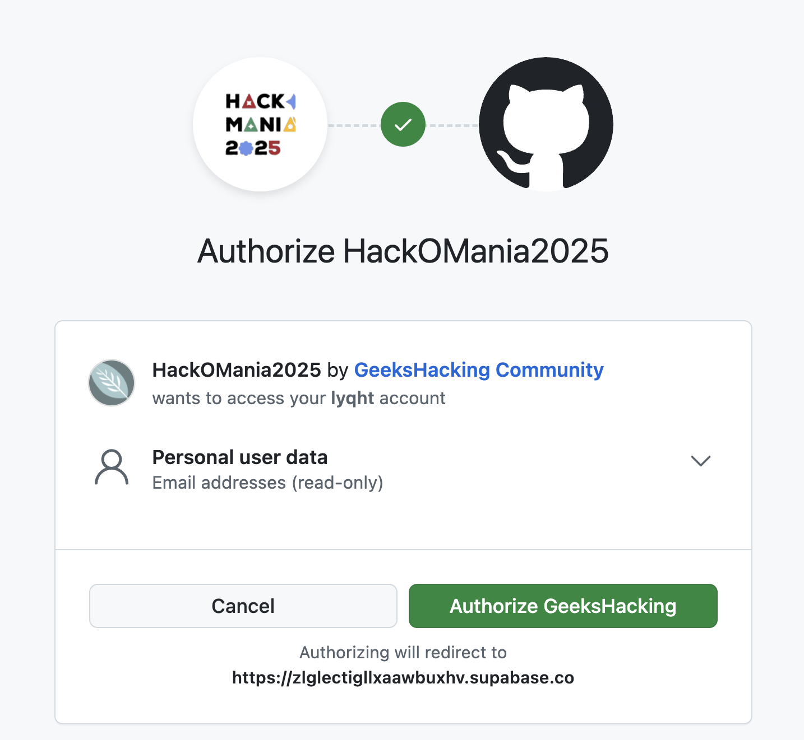

# HackOMania 2025

<div align="center" style="background:white;">
  
</div>

## Introduction

HackOMania 2025 is a hackathon event organized by [GeeksHacking](https://geekshacking.com).
This repository contains the web application for HackOMania 2025's landing page, user's team management portal, and the admin portal.

The web development team behind this project consists of:

- Estee Tey ([@lyqht](https://github.com/lyqht))
- Ethan Chew ([@Ethan-Chew](https://github.com/Ethan-Chew))
- Sam Tan ([@MisterDoobDoob](https://github.com/MisterDoobDoob))

## Table of Contents

- [Introduction](#introduction)
- [Tech Stack](#tech-stack)
- [Deployment](#deployment)
- [Local Development](#local-development)
  - [Required Environment Variables](#required-environment-variables)
  - [Optional Environment Variables](#optional-environment-variables)
  - [Admin Access](#admin-access)
  - [Starting the app](#starting-the-app)
  - [Creating a user](#creating-a-user)
  - [User Redirection](#user-redirection)
- [Supabase](#supabase)
  - [Edge Functions](#edge-functions)
- [Drizzle](#drizzle)
  - [Creating Schemas](#creating-schemas)
  - [Generating Migrations](#generating-migrations)
  - [Applying Migrations](#applying-migrations)
  - [Best Practices](#best-practices)

## Tech stack

- Next.js for frontend
- Tailwind CSS for styling
- shadcn/ui for components
- Supabase for database, authentication and edge functions
- Drizzle ORM for migrations and queries

## Deployment

- This project has been deployed at [https://hackomania2025.vercel.app/](https://hackomania2025.vercel.app/) using [Supabase Vercel Integration and Vercel deploy](#deploy-your-own) where environment variables are automatically assigned to the project.
- The custom domain assigned via Vercel can be found at https://hackomania.geekshacking.com.

## Local Development

### Required Environment Variables

Copy `.env.example` to `.env` and fill in the following required environment variables:

```bash
POSTGRES_URL=           # Your Supabase PostgreSQL URL
SUPABASE_URL=          # Your Supabase project URL
NEXT_PUBLIC_SUPABASE_URL= # Same as SUPABASE_URL
NEXT_PUBLIC_SUPABASE_ANON_KEY= # Your Supabase anonymous key
SUPABASE_SERVICE_ROLE_KEY= # Your Supabase service role key
GITHUB_CLIENT_ID=      # Your GitHub OAuth app client ID
GITHUB_CLIENT_SECRET=  # Your GitHub OAuth app client secret
```

### Optional Environment Variables

```bash
# Comma-separated list of GitHub usernames that should be granted admin access
# Example: ADMIN_USERS=user1,user2,user3
ADMIN_USERS=           # List of GitHub usernames for admin access

# Pre-event registration settings
NEXT_PUBLIC_EVENTBRITE_PREEVENT_EVENT_ID= # Eventbrite event ID for pre-event
EVENTBRITE_PRIVATE_TOKEN=                  # Eventbrite API token
```

### Admin Access

The `ADMIN_USERS` environment variable controls which users get admin access in the application. When a user signs in with GitHub:

1. Their GitHub username is checked against the `ADMIN_USERS` list
2. If their username is in the list, they are automatically granted admin role
3. Admin users are redirected to `/admin` after signing in
4. Admin users have access to additional features like:
   - User management
   - Team management
   - Challenge management

To add or remove admin users:

1. Update the `ADMIN_USERS` environment variable with a comma-separated list of GitHub usernames
2. No spaces between usernames, just commas
3. Example: `ADMIN_USERS=username1,username2,username3`

### Starting the app

1. Install dependencies using [pnpm](https://pnpm.io/).
2. You can now start the Next.js local development server:

   ```bash
   pnpm dev
   ```

   The app should now be running on [localhost:3000](http://localhost:3000/).

### Creating a user

When you sign in with GitHub, you will be redirected to the authorization page. You have to approve the app to access your GitHub account as following.



### User Redirection

After successful GitHub authentication, users are redirected based on their role:

1. **Admin Users**

   - Users listed in the `ADMIN_USERS` environment variable are automatically assigned the admin role
   - They are redirected to `/admin` after signing in
   - The admin dashboard provides access to:
     - User management (view, edit, remove users)
     - Team management (create, edit, delete teams)
     - Challenge management (create, edit challenges)
     - Registration statistics and data

2. **Participants**
   - Regular users (not in `ADMIN_USERS` list) are assigned the participant role
   - They are redirected to `/user/home` after signing in
   - The participant dashboard provides access to:
     - Personal profile management
     - Team creation or joining
     - Challenge selection and participation
     - Event information and updates

### Supabase

- Check out [the docs for Local Development](https://supabase.com/docs/guides/getting-started/local-development) to run Supabase locally.
- Auth with GitHub is added by following this guide for [Login with GitHub | Supabase Docs](https://supabase.com/docs/guides/auth/social-login/auth-github).

#### Edge Functions

The project includes Supabase Edge Functions to handle event registrations:

1. **fetch-eventbrite-attendees**

   - **Purpose**: Retrieves attendees from a specified Eventbrite event, handling pagination automatically to get all attendees
   - **Required Environment Variables**:
     - `EVENTBRITE_EVENT_ID`: The ID of the Eventbrite event
     - `EVENTBRITE_PRIVATE_TOKEN`: Eventbrite private token obtained through creating an Eventbrite api key
     - `SUPABASE_URL`: Your Supabase project URL
     - `SUPABASE_SERVICE_ROLE_KEY`: Your Supabase service role key
   - **Query Parameters**:
     - `email` (optional): Find an attendee by their email address
     - `latest` (optional): Set to "1" to bypass cache and fetch latest data from Eventbrite
   - **Caching**:
     - Results are cached in Supabase database for 24 hours to minimize Eventbrite API calls
     - Cache is bypassed when `latest=1` is used
     - Cache is automatically refreshed after expiration
     - Cache persists across function instances and cold starts

2. **prepopulate-google-sheets-main-event-registrations**
   - **Purpose**: Processes registrations from a Google Sheets CSV export, creating records in multiple tables (registrations, users, teams, team members)
   - **Required Environment Variables**:
     - `SUPABASE_URL`: Your Supabase project URL
     - `SUPABASE_ANON_KEY`: Your Supabase anonymous key
   - **Input**:
     - CSV file via form data with specific columns (Email Address, First Name, Last Name, etc.)
   - **Features**:
     - Bulk upsert operations for better performance
     - Handles team creation and membership
     - Validates GitHub profile URLs
     - Prevents duplicate entries using unique constraints
   - **Processing Flow**:
     1. Creates/updates main event registrations
     2. Creates/updates users for team members
     3. Creates/updates teams
     4. Creates/updates team memberships
   - **Response**: Returns statistics about created/updated records

To test the functions:

```bash
# Fetch Eventbrite Pre-event attendees
curl -i --location --request GET 'https://<project-ref>.supabase.co/functions/v1/fetch-eventbrite-attendees' \
  --header 'Authorization: Bearer <supabase-anon-key>'

# Process Google Sheets registrations that are approved by the admins
curl -i --location --request POST 'https://<project-ref>.supabase.co/functions/v1/prepopulate-google-sheets-main-event-registrations' \
  --header 'Authorization: Bearer <supabase-anon-key>' \
  --form 'file=@"registrations.csv"'
```

Or using the Supabase client in your Next.js application:

```typescript
// Fetch Eventbrite Pre-event attendees
const { data: allAttendees, error } = await supabase.functions.invoke("fetch-eventbrite-attendees");

// Process Google Sheets registrations that are approved by the admins
const formData = new FormData();
formData.append("file", csvFile);
const { data, error } = await supabase.functions.invoke(
  "prepopulate-google-sheets-main-event-registrations",
  {
    body: formData,
  },
);
```

### Drizzle

Below are the steps to create schemas and generate migrations.

> For more detailed information, refer to the [Drizzle ORM documentation](https://orm.drizzle.team/docs/overview).

#### Creating Schemas

1. Define your schema in the `utils/db/schema` directory. For example:

   ```typescript:utils/db/schema/users.ts
   import { pgTable, serial, text, timestamp } from 'drizzle-orm/pg-core';

   export const users = pgTable('users', {
     id: serial('id').primaryKey(),
     name: text('name').notNull(),
     email: text('email').notNull().unique(),
     createdAt: timestamp('created_at').defaultNow().notNull()
   });
   ```

2. If you have multiple schema files, you can create an index file to export them all:

   ```typescript:utils/db/schema/index.ts
   export * from './users';
   export * from './teams';
   // ... other schema exports
   ```

#### Generating Migrations

After defining or updating your schema, generate migrations using Drizzle Kit:

1. Run the following command:

   ```bash
   npx drizzle-kit generate --name=some_change
   ```

2. This will create a new migration file in the `./drizzle` directory (as specified in `drizzle.config.ts`).

3. Review the generated SQL in the migration file to ensure it matches your intended changes.

#### Applying Migrations

To apply the migrations to your database:

1. Run the following command:

   ```bash
   npx drizzle-kit push
   ```

2. This will apply any pending migrations to your database.

#### Best Practices

- Always review generated migrations before applying them to your database.
- Commit both your schema files and the generated migration files to version control.
- In a team environment, coordinate database changes to avoid conflicts.
